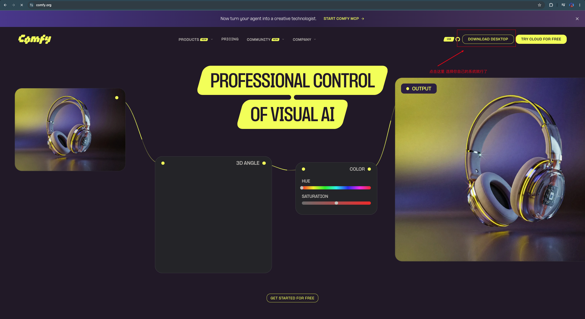
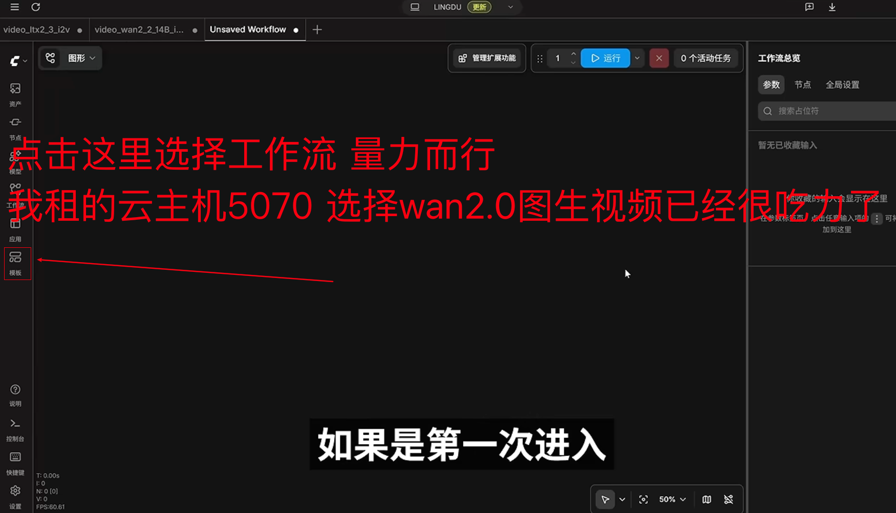
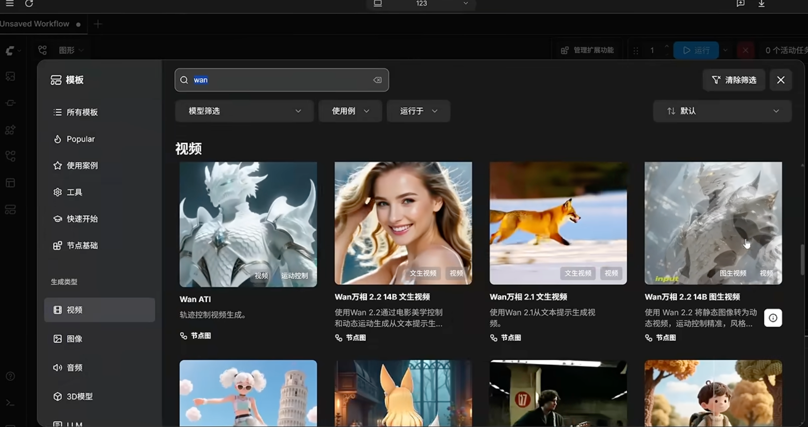
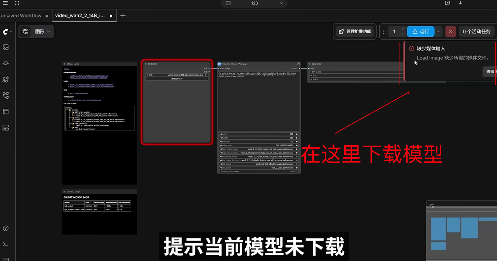
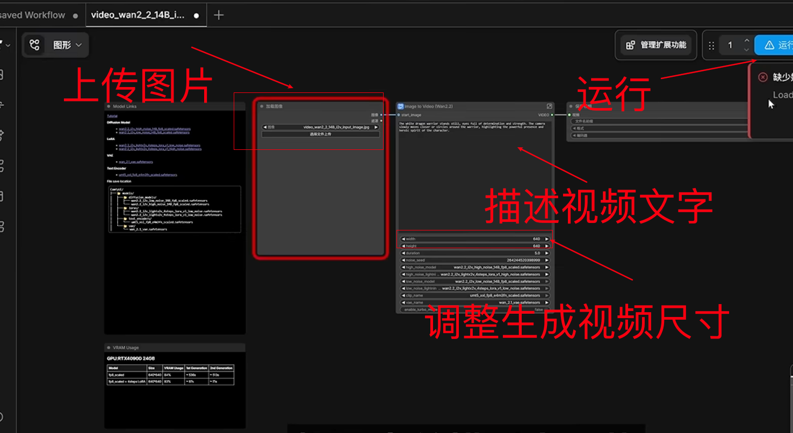

# 记一下怎么本地部署ai生成视频模型

## 一、下载comfyUI

https://comfy.org/[](https://comfy.org/)

首先ComfyUI是一个帮你快速部署其他ai模型的软件，没有这个东西你自己拉别人的模型也是能部署的，但是这个软件是图形化的，帮助你实现点击就能部署。方便不会开发的人来快速部署，并且软件有工作流，当你下完模型后即可使用模型默认工作流，也可以自己设置工作流。

重点：**下载需要翻墙**



**下载之后安装 不要装在C盘** 之后进入

选择模型工作流 







选择完成之后 要下载模型 这个很大 大概有十几个g 我租的云电脑翻墙的话 下载要一小时多 这个也需要翻墙下载 

下载完成之后就是上传图片 和 描述文字 来生成视频



## 二、生成漫剧工作流程

1. 首先使用豆包来将小说文字章节 做成分镜 提示词

   ```
   帮我把这章小说改成视频脚本 并把脚本分割成每段5s的镜头 
   ```

2. 生成主角和配角角色图片

   ```
   帮我按照这些提示词生成动漫角色
   ```

3. 把每段分镜都初始一张图片 上传主角图片和配角图片 图片名就是角色名

   ```
   帮我按照我发你的主角.png和反派.png把这段分镜生成一张图片
   ```

4. 把分镜图片上传 并把ai给的分镜脚本粘贴到描述视频文字 并调整视频时常为5s 一个个分镜的生成 最后拼接视频即可得到 完整一章的漫剧


## 三、最无脑 最快速 最牛流程

直接微信联系me 让me向日葵远程控制电脑 来生成漫剧